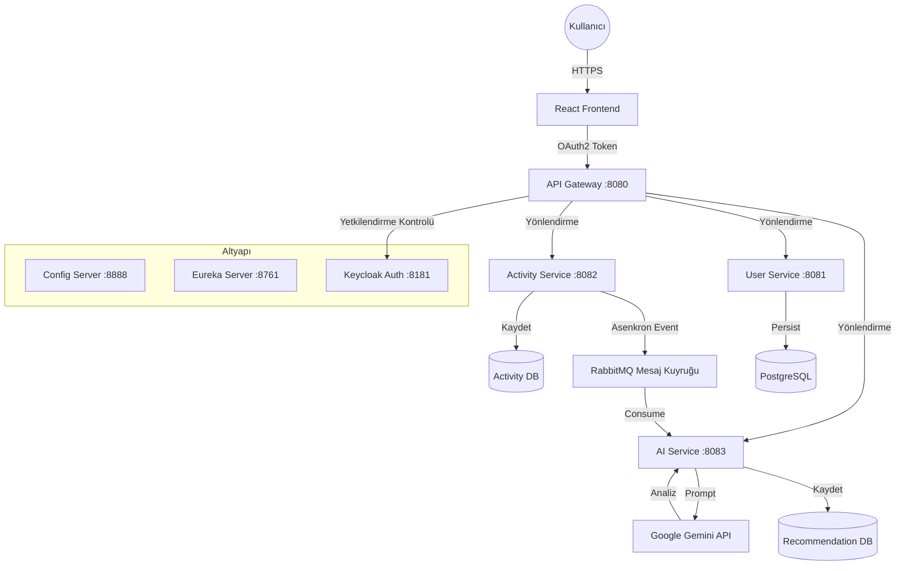

# 🏋️‍♂️ Yapay Zekâ Destekli Fitness Mikroservis Platformu

Ölçeklenebilir ve event-driven bir fitness takip mikroservis mimarisi. Bu proje, asenkron iletişim için **Spring Boot** ve **RabbitMQ**, kişiselleştirilmiş antrenman analizi ve önerileri sunmak için **Google Gemini AI** kullanır. Frontend tarafı **React** ile geliştirilmiş olup **Keycloak** kullanılarak **OAuth2 PKCE** akışıyla güvence altına alınmıştır.

---

## 📚 Dokümantasyon & Eğitim

Bu sistemi sıfırdan nasıl oluşturduğumu adım adım anlatan kapsamlı bir Medium serisi yazdım. Kodun arkasındaki mimari kararları anlamak için tüm seriyi okuyabilirsiniz.

[**📖 Medium’daki Tüm Seriyi Oku**](https://medium.com/@akgullberk/spring-boot-gemini-api-keycloak-api-gateway-ve-rabbitmq-ile-microservice-mimarisi-458601543690)

---

## 🏗️ Mimari

Sistem, yapay zekâ işlemleri için Olay Güdümlü (Event-Driven) tasarıma sahip bir Mikroservis Mimarisi desenini takip eder.

## 🧩 Servislere Genel Bakış

### 🎛️ Config Server (`:8888`)
- **Açıklama:** Tüm mikroservisler için merkezi konfigürasyon yönetimi sağlar.
- **Teknoloji:** Spring Cloud Config (Native Profile).

### 🔍 Eureka Server (`:8761`)
- **Açıklama:** Mikroservislerin sabit URL’lere ihtiyaç duymadan birbirlerini dinamik olarak bulmasını sağlayan servis keşif sunucusu.
- **Teknoloji:** Netflix Eureka.

### 🚪 API Gateway (`:8080`)
- **Açıklama:** Sistemin tek giriş noktasıdır. Yönlendirme, yük dengeleme ve merkezi güvenlik/kimlik doğrulama işlemlerini yönetir.
- **Teknoloji:** Spring Cloud Gateway, Reactive Security.

### 👤 User Service (`:8081`)
- **Açıklama:** Kullanıcı kayıtlarını ve profillerini yönetir, Keycloak ile otomatik veri senkronizasyonu sağlar.
- **Teknoloji:** PostgreSQL, Spring Data JPA.

### 🏃 Activity Service (`:8082`)
- **Açıklama:** Antrenman verileri için CRUD işlemlerini yönetir ve asenkron analiz için RabbitMQ’ya event yayınlar.
- **Teknoloji:** MongoDB, Spring AMQP (RabbitMQ).

### 🧠 AI Service (`:8083`)
- **Açıklama:** Kuyruktaki antrenman event’lerini tüketir, detaylı analiz için Google Gemini AI ile iletişime geçer ve önerileri saklar.
- **Teknoloji:** MongoDB, Google Gemini API, RabbitMQ Listener.

### 💻 Frontend (`:5173`)
- **Açıklama:** Antrenman takibi, kimlik doğrulama yönetimi ve yapay zekâ tarafından üretilen içgörülerin görüntülenmesi için kullanıcı arayüzü.
- **Teknoloji:** React, Vite, Redux Toolkit, OAuth2 PKCE.

---

## 🛠️ Teknoloji Yığını

### Backend & Altyapı
- **Dil:** Java 17  
- **Framework:** Spring Boot 3.0, Spring Cloud (Gateway, Config, Eureka)  
- **Güvenlik:** Spring Security, OAuth2 Resource Server  
- **Mesajlaşma:** RabbitMQ (Event-Driven Architecture)  
- **Veritabanları:**
  - **PostgreSQL:** İlişkisel kullanıcı verileri için.
  - **MongoDB:** Yapılandırılmamış aktivite ve öneri verileri için.

### Yapay Zekâ & Akıllı Sistemler
- **Model:** Google Gemini Pro  
- **Entegrasyon:** REST tabanlı yapay zekâ iletişimi için Spring WebClient

### Frontend
- **Framework:** React 18 (Vite)  
- **Durum Yönetimi:** Redux Toolkit  
- **Stil:** Material UI (MUI)  
- **Kimlik Doğrulama:** PKCE ile OAuth2 Authorization Code Flow

### DevOps & Araçlar
- **Kimlik Sağlayıcı:** Keycloak  
- **Build Aracı:** Maven  
- **Container:** Docker (Veritabanları & Keycloak için önerilir)

---

## 📂 Proje Yapısı

Altyapı ile iş mantığını ayıran, fonksiyonlara göre düzenlenmiş bir mikroservis deposu.

- **🗂️ configserver/**
  - Tüm mikroservisler için merkezi konfigürasyon yönetimi.
- **🔍 eureka/**
  - Dinamik servis kaydı için servis keşif sunucusu.
- **🚪 gateway/**
  - Yönlendirme, SSL sonlandırma ve güvenlik/auth filtrelerini yöneten API Gateway.
- **👤 userservice/**
  - Kullanıcı verilerini (PostgreSQL) yönetir ve Keycloak ile senkronize eder.
- **🏃 activityservice/**
  - Antrenman verilerini (MongoDB) saklar ve RabbitMQ’ya event yayınlar.
- **🧠 aiservice/**
  - Antrenman event’lerini tüketir ve Google Gemini AI kullanarak içgörüler üretir.
- **💻 fitness-app-frontend/**
  - React, Vite ve Material UI ile geliştirilmiş istemci tarafı uygulama.

